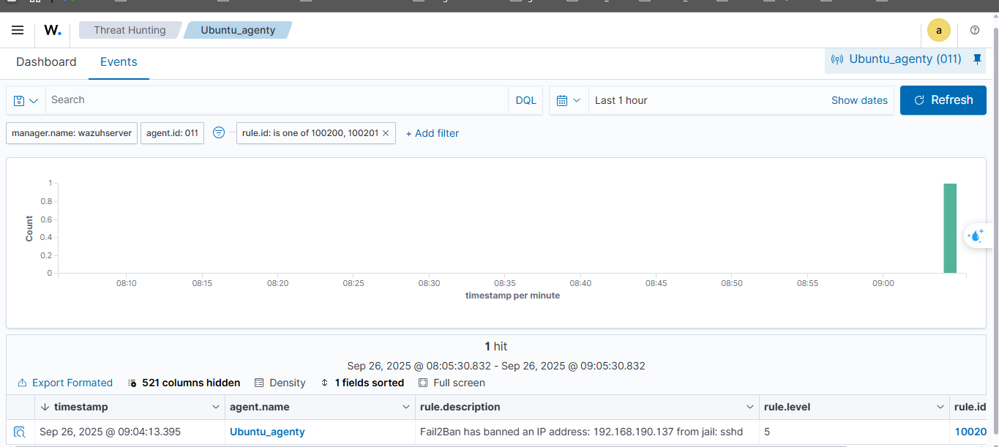
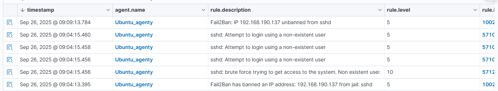

# Task#1: Detection of Unauthorized Access on Linux Blocked
[https://www.linkedin.com/posts/ghobadi-saeid_wazuh-activity-7360878789855191040-i4Si/](https://www.linkedin.com/posts/ghobadi-saeid_wazuh-activity-7360878789855191040-i4Si/)

Bài viết này sẽ sử dụng Wazuh

## Bước 1
Điều kiện kiên quyết là bạn đã cài sẵn Wazuh server ở Ubuntu server và Wazuh agent ở Ubuntu
Bước này mình khá gặp nhiều khó khăn, sau đó mình rút ra kinh nghiệm là dùng `scp` để copy key bằng lệnh 
```bash
sudo /var/ossec/bin/manage_agents -e 'ID agent'> /tmp/agent.key
scp /tmp/agent.key user@IP_AGENT:/tmp/
# ở máy agent
cat /tmp/agent.key
#copy key về
sudo /var/ossec/bin/manage_agents
# sau đó khởi động lại
sudo systemctl restart wazuh-agent
sudo systemctl enable wazuh-agent
```
## Bước 2
Trên máy `Ubuntu agent` chạy lệnh
```
sudo apt-get install -y fail2ban 
```
Sau khi cài 
``` 
sudo systemctl start fail2ban
sudo systemctl status fail2ban
```
## Bước 3
Đảm bảo SSH đang chạy;
```
sudo apt-get install -y openssh-server
sudo systemctl enable ssh
sudo systemctl start ssh
sudo systemctl status ssh
```
## Bước 4
Thêm 1 số cấu hình log ở Ubuntu agent
Mở cấu hình agent
```
sudo nano /var/ossec/etc/ossec.conf
```
Trong phần <ossec_config> (hoặc trước/đâu đó các <localfile> khác), thêm 2 block sau ở ngay sau 1 tag `<localfile>` ở `<!log analsys>`, đừng lo đến việc có 2 tag `<ossec_config>` vì nó là bình thường [Link giải thích](https://github.com/wazuh/wazuh-packages/issues/17):
```xml
<localfile>
  <log_format>syslog</log_format>
  <location>/var/log/auth.log</location>
</localfile>

<localfile>
  <log_format>syslog</log_format>
  <location>/var/log/fail2ban.log</location>
</localfile>
```
Lưu file (Ctrl+O, Enter, Ctrl+X) và sau đó restart agent:
```bash
sudo systemctl restart wazuh-agent
```
Kiểm tra agent local log để chắc nó đọc file:
```bash
sudo tail -n 100 /var/ossec/logs/ossec.log
# hoặc quan sát real-time
sudo tail -f /var/ossec/logs/ossec.log
```
Kiểm tra jail ssh status:
```bash
sudo fail2ban-client status sshd
```
## Bước 5
Cấu hình Fail2ban cho SSH
Tạo file riêng để override `/etc/fail2ban/jail.local`, không ghi đè ở file gốc `/etc/fail2ban/jail.conf`
```bash
sudo nano /etc/fail2ban/jail.local
```
Thêm đoạn sau:
```
[sshd]
enabled = true          # Bật giám sát SSH
port = ssh              # Mặc định 22 (hoặc đổi nếu SSH bạn dùng port khác)
logpath = /var/log/auth.log
backend = systemd       # hoặc auto, tùy distro
maxretry = 3            # Số lần nhập sai trước khi bị ban
findtime = 300          # Trong vòng 300s (5 phút) mà sai 3 lần -> ban
bantime = 300           # Ban trong 300s (5 phút)
```
Kiểm tra và khởi động lại:
```bash
sudo systemctl restart fail2ban
sudo systemctl enable fail2ban
```
Kiểm tra tình trạng:
```bash
sudo fail2ban-client status
sudo fail2ban-client status sshd
```

## Bước 6 (Wazuh-server)
Cấu hình rule để detect , đọc log của Fail2ban.

Ở giao diện web, cần điều chỉnh decoder.
Ở `Server Management` chọn `Decoders` sau đó chọn `Custom decoders` rồi chọn `Add new decoders file`, lưu với tên `fail2ban_decoder.xml`:
```xml
<decoder name="fail2ban">
  <prematch>[\d+]:\s*\w+\s*[\w*]</prematch>
</decoder>

<decoder name="fail2ban">
  <parent>fail2ban</parent>
  <regex>[(\d+)]:\s*(\w+)\s*[(\w*)]\s*(\w*)\s*(\d+.\d+.\d+.\d+)$</regex>
  <order>process_id,log_level,jail,action,srcip</order>
</decoder>
```

Tương tự

Ở giao diện web, cần điều chỉnh decoder.
Ở `Server Management` chọn `Rules` sau đó chọn `Custom Rule` rồi chọn `Add new rule file`, lưu với tên `fail2ban_rules.xml`:

Nhập các dòng sau:
```xml
<!-- Modify it at your will. -->
<group name="fail2ban,">
 <rule id="100200" level="5">
 <decoded_as>fail2ban</decoded_as>
 <action>Ban</action>
 <description>Fail2Ban has banned an IP address: $(srcip) from jail: $(jail)</description>
 <group>authentication_failure,</group>
 </rule>
</group>
<group name="fail2ban,">
 <rule id="100201" level="5">
 <decoded_as>fail2ban</decoded_as>
 <action>Unban</action>
 <description>Fail2Ban: IP $(srcip) unbanned from $(jail)</description>
<group>authentication_success,</group>
 </rule>
</group>

```
Cuối cùng ta sẽ dùng 1 máy ảo kali linux để tấn công hydra

Trước tiên hãy ping vào địa chỉa của Agent để kiểm tra kết nối 

Sau đó nhập lệnh
```bash
─$ hydra -l helloworld -P pwlist.txt -t 4 ssh://192.168.190.140 -s 22 -f
```
Với `pwlist.txt` tự tạo tùy ý .
```bash
└─$ cat pwlist.txt
password
123456
helloanhem
admin
```
Cuối cùng ta vào `Threat Intelligence` -> `Threat Hunting` -> `Event` , sau đó có thể lọc theo `rule.id` hoặc nhìn vào các event phía dưới.



Bài lab này cho mình rất nhiều bài học. Lúc đầu mình toàn crop cut ảnh để lấy key của agent vào GG lens nên không được chính xác, nên đã dùng lệnh `scp` để copy chính xác key. Tiếp theo là đến viết truyền thêm log của `fail2ban` vào cho wazuh, logcollector, mình đã bị rất nhiều lỗi ở đấy do không biết viết ở đâu và như thế nào.

Cảm ơn mọi người đã đọc bài viết của mình.❤️ 
Mong mọi người tiếp tục ủng hộ các bài viết tiếp theo.